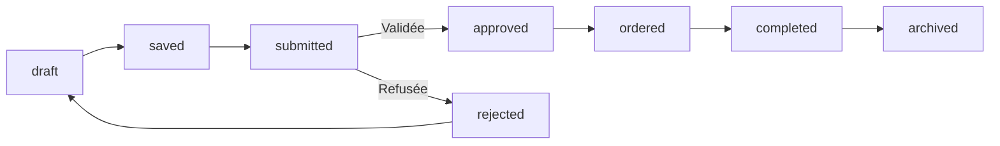

# Système de Statuts des Recettes

## Vue d'ensemble

Le système de statuts permet de suivre le cycle de vie complet d'une recette, de sa création jusqu'à son archivage. Chaque statut représente une étape spécifique dans le processus de gestion des recettes.

## Statuts disponibles

| Code | Nom affiché | Icône | Description | Couleur |
|------|-------------|-------|-------------|---------|
| `draft` | En cours | 📝 | Recette en cours d'édition, pas encore finalisée | Gris |
| `saved` | Enregistrée | 💾 | Recette validée et enregistrée manuellement ou par IA | Bleu |
| `submitted` | Soumise | 📤 | Recette envoyée pour validation, supervision ou revue | Jaune |
| `approved` | Approuvée | ✅ | Recette validée par un humain (ou système automatique) | Vert |
| `ordered` | Commandée | 🛒 | Les ingrédients ont été ajoutés au panier ou commandés | Violet |
| `completed` | Complète | 🍽️ | Recette préparée et tous les ingrédients sont traités | Émeraude |
| `archived` | Archivée | 📦 | Recette terminée ou mise de côté, non modifiable | Slate |
| `rejected` | Rejetée | ❌ | Recette refusée (incomplète, non conforme, etc.) | Rouge |

## Transitions de statut



### Transitions autorisées

- **draft** → **saved** : Enregistrement de la recette
- **saved** → **submitted** : Soumission pour validation
- **saved** → **draft** : Retour à l'édition
- **submitted** → **approved** : Validation (admin uniquement)
- **submitted** → **rejected** : Rejet (admin uniquement)
- **approved** → **ordered** : Commande des ingrédients
- **ordered** → **completed** : Réalisation de la recette
- **completed** → **archived** : Archivage
- **rejected** → **draft** : Retour à l'édition

## Implémentation technique

### Backend (Strapi)

#### Schéma de base de données
```json
{
  "status": {
    "type": "enumeration",
    "required": false,
    "default": "draft",
    "enum": [
      "draft",
      "saved", 
      "submitted",
      "approved",
      "ordered",
      "completed",
      "archived",
      "rejected"
    ]
  }
}
```

#### Migration
```javascript
// database/migrations/2024-01-02-000000-add-status-to-recipies.js
await knex.schema.alterTable('recipies', (table) => {
  table.enum('status', [
    'draft', 'saved', 'submitted', 'approved', 
    'ordered', 'completed', 'archived', 'rejected'
  ]).defaultTo('draft').notNullable();
});
```

### Frontend (Next.js)

#### Types TypeScript
```typescript
export type RecipeStatus = 
  | 'draft' | 'saved' | 'submitted' | 'approved' 
  | 'ordered' | 'completed' | 'archived' | 'rejected'

export interface StatusInfo {
  code: RecipeStatus
  displayName: string
  description: string
  icon: string
  color: string
}
```

#### Composants
- `RecipeStatusBadge` : Affichage du badge de statut
- `RecipeStatusActions` : Actions disponibles selon le statut
- `RecipeStatusManager` : Gestionnaire complet des statuts

#### API Service
```typescript
// Mise à jour du statut
async updateRecipeStatus(id: number, status: RecipeStatus): Promise<RecipeResponse>

// Récupération par statut
async getRecipesByStatus(status: RecipeStatus): Promise<RecipesResponse>

// Récupération des recettes en attente
async getPendingRecipes(): Promise<RecipesResponse>
```

## Utilisation par écran

### Formulaire de recette (`/creer-recette`)
- **Actions** : Saisie, Enregistrer, Soumettre
- **Statuts** : draft, saved, submitted
- **Composant** : `RecipeStatusManager`

### Détail recette (`/recette/:id`)
- **Actions** : Commander, Marquer comme cuisinée
- **Statuts** : submitted, approved, ordered, completed
- **Affichage** : `RecipeStatusBadge`

### Tableau utilisateur (`/mes-recettes`)
- **Actions** : Voir progression, Archiver
- **Statuts** : Tous
- **Filtres** : Par statut

### Backoffice admin (`/admin/recettes`)
- **Actions** : Valider, Rejeter, Archiver
- **Statuts** : submitted, approved, rejected
- **Composant** : Interface d'administration

## Configuration

### Variables d'environnement
```env
# Frontend
NEXT_PUBLIC_API_URL=http://localhost:1338

# Backend
DATABASE_HOST=localhost
DATABASE_PORT=5432
DATABASE_USERNAME=postgres
DATABASE_PASSWORD=postgres
DATABASE_NAME=strapi
```

### Installation

1. **Backend** : Exécuter la migration
```bash
cd backend-js
node run-migration-status.js
```

2. **Frontend** : Vérifier les types
```bash
cd frontend-m
npm run build
```

3. **Test** : Vérifier le fonctionnement
```bash
cd frontend-m
node test-status-system.js
```

## Sécurité et permissions

### Rôles utilisateur
- **Utilisateur standard** : Peut créer, éditer, soumettre ses recettes
- **Admin** : Peut approuver/rejeter les recettes soumises
- **Système** : Transitions automatiques (IA, notifications)

### Validation des transitions
- Vérification côté client et serveur
- Logs des changements de statut
- Notifications aux utilisateurs concernés

## Monitoring et analytics

### Métriques à suivre
- Nombre de recettes par statut
- Temps moyen par statut
- Taux de conversion entre statuts
- Recettes rejetées (raisons)

### Logs
```javascript
// Exemple de log de transition
{
  recipeId: 123,
  fromStatus: 'submitted',
  toStatus: 'approved',
  userId: 'admin_456',
  timestamp: '2024-01-02T10:30:00Z',
  reason: 'Validation manuelle'
}
```

## Évolutions futures

### Fonctionnalités prévues
- Workflow personnalisable par catégorie
- Notifications automatiques
- Historique des changements de statut
- Statistiques avancées
- Intégration avec le système de commande

### Améliorations techniques
- Validation des transitions côté serveur
- Cache des statuts fréquents
- Optimisation des requêtes par statut
- Interface d'administration avancée 